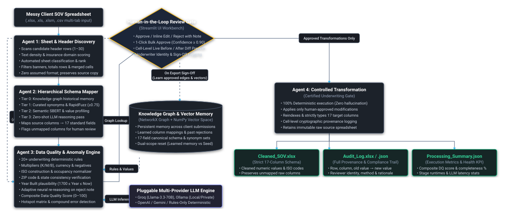

<div align="center">

# SOV-it
### Agentic Statement of Values Cleansing and Intelligence System
*An autonomous multi-agent platform for commercial property underwriting data transformation, schema mapping, and validation.*

[](https://www.python.org/)
[](LICENSE)
[](#high-level-system-architecture)
[](https://share.streamlit.io/deploy?repository=ranjanaashish/SOV-it&branch=main&mainModule=app.py)
[](#contributors-and-institutional-partners)

---

**Developed by Team Astra**  
*As part of the ADROSONIC Build Hackathon*  
*In collaboration with **Adrosonic** and **Birla Institute of Technology, Mesra (BIT Mesra)***

App link: sov-it.streamlit.app

</div>

---

## Executive Summary

Underwriting commercial property insurance requires processing unstructured, non-standardised client Statements of Values (SOV) spreadsheets. Real-world client submissions frequently contain unaligned column headers, mixed alphanumeric notations, compound value errors, missing geographic attributes, and inconsistent building occupancy classifications. These defects lead to operational delays, accumulation blindspots, and manual data-entry overhead.

**SOV-it** is an enterprise-grade agentic platform that automates the ingestion, mapping, validation, and transformation of complex client SOVs into standardised, verified schemas.

### Core Architectural Principle
> **The language model proposes; deterministic logic and human underwriters verify and commit.**

The platform enforces **100 per cent human-in-the-loop governance**, persistent graph-based institutional memory across submissions, and a certified transformation gate guaranteeing zero schema drift.

---

## High-Level System Architecture

<div align="center">
  
</div>

---

## Autonomous Agent Architecture

| Agent | Responsibility | Core Methodology |
| :--- | :--- | :--- |
| **Agent 1: Sheet and Header Discovery** | Analyzes multi-tab workbooks without assumed structure. Scans candidates across rows 1–30 based on text ratio, density, insurance domain vocabulary, and value distribution below. Identifies totals rows, title banners, and merged cells. | Density-distribution heuristics, vocabulary scoring, OpenPyXL grid parsing. |
| **Agent 2: Hierarchical Schema Mapper** | Maps source columns to the 17 standard insurance target fields via a tiered resolution strategy: <br>• **Tier 0:** Knowledge Graph historical memory and vector search.<br>• **Tier 1:** Curated synonym dictionaries and RapidFuzz token matching ($\ge 0.75$).<br>• **Tier 2:** Semantic Sentence-BERT embeddings blended with value profiling.<br>• **Tier 3:** Zero-shot constrained LLM reasoning for remaining ambiguous headers. | NetworkX Graph, Sentence-BERT, RapidFuzz, Pluggable LLM. |
| **Agent 3: Data Quality and Reasoning Engine** | Validates over 20 underwriting rules including currency parsing, multiplier expansion (K, M, B), negative value detection, construction code normalization, ZIP/State consistency, and Year Built plausibility. Generates formal explanations and executes **adaptive re-reasoning loops** upon underwriter rejection. | Rulebook engine, regular expressions, contextual re-reasoning. |
| **Agent 4: Controlled Transformation** | Deterministic transformation engine with zero generative hallucination risk. Applies only underwriter-approved modifications, retains raw data on an immutable source copy, enforces strict schema typing, and generates cell-level provenance audit logs. | Pandas, OpenPyXL, cryptographic provenance hashing. |

---

## Target Schema Specification (17 Standard Fields)

SOV-it standardizes all incoming data into the 17-field commercial insurance property schema:

| Target Field | Data Type | Permissible Range / Formats | Validation and Cleansing Logic |
| :--- | :--- | :--- | :--- |
| `Location ID` | String / Alphanumeric | Unique property identifier | Trimmed, deduplicated, preserves leading zeros |
| `Street Address` | String | Postal street address | Cleaned punctuation, casing standardized |
| `City` | String | City name | Standardized casing, whitespace stripped |
| `State` | String | 2-Letter US Postal Code (`CA`, `NY`) | Resolves full state names to standard 2-letter codes |
| `Zip Code` | String | 5-Digit or 9-Digit (`12345`, `12345-6789`) | Padded leading zeros, standardizes hyphenation |
| `County` | String | County jurisdiction | Normalized naming conventions |
| `Country` | String | ISO country code or standard name | Resolves spelling drift (`USA`, `US`, `United States`) |
| `Building Value` | Float | $\ge 0$ | Strips currency symbols, expands numeric multipliers |
| `Contents Value` | Float | $\ge 0$ | Numeric parsing, negative values flagged |
| `Business Interruption Value` | Float | $\ge 0$ | Standardized financial evaluation |
| `Total Insurable Value (TIV)` | Float | $\ge 0$ | Cross-checked against sum of component values |
| `Square Footage` | Float | $\ge 0$ | Parses commas and area units (`sq ft`, `sf`) |
| `Number of Stories` | Integer | $\ge 1$ | Cast to whole integers; fractional stories flagged |
| `Year Built` | Integer | $1700 \le \text{Year} \le \text{Current Year}$ | Flags future years; resolves two-digit years |
| `Construction Type` | Categorical | ISO Construction Classes (1–6, `MFR`, `NC`) | Normalized to standard structural classifications |
| `Occupancy Type` | Categorical | Commercial occupancy codes (`Office`, `Retail`) | Curated insurance categorization |
| `Sprinkler Flag` | Categorical | `Y` / `N` / Valid sprinkler class (`13`, `13R`) | Standardized binary and sprinkler class indicators |

---

## Installation and Quickstart

### Local Setup

```bash
# 1. Clone repository
git clone https://github.com/ranjanaashish/SOV-it.git
cd SOV-it

# 2. Configure virtual environment
python -m venv .venv
source .venv/bin/activate       # On Windows: .venv\Scripts\activate

# 3. Install dependencies
pip install -r requirements.txt

# 4. Run the application
streamlit run app.py
```
*The local interface will be accessible at `http://localhost:8501`.*

### Streamlit Community Cloud (1-Click Deployment)

Deploy directly to Streamlit Community Cloud:

[](https://share.streamlit.io/deploy?repository=ranjanaashish/SOV-it&branch=main&mainModule=app.py)

1. Click the **Deploy with Streamlit** badge above.
2. Sign in with GitHub.
3. Confirm repository (`ranjanaashish/SOV-it`), branch (`main`), and main file path (`app.py`).
4. Click **Deploy!**

### Docker Deployment

```bash
docker compose up -d --build
```

---

## LLM Configuration and Provider Support

SOV-it supports multiple inference backends configurable directly via the sidebar:

- **Groq Cloud** (`llama-3.3-70b-versatile` — high-throughput inference)
- **Ollama Local** (`qwen2.5:7b-instruct` / `qwen2.5:3b-instruct` — fully on-premise, offline execution)
- **OpenAI / Azure OpenAI** (`gpt-4o-mini`, `gpt-4o`)
- **Google Gemini** (`gemini-1.5-flash` via OpenAI-compatible endpoint)
- **Custom OpenAI Endpoints** (vLLM, LM Studio, LocalAI)
- **Rules-Only Deterministic Mode** (Instant execution with zero network dependency)
---

## Contributors and Institutional Partners

Developed by **Team Astra** as part of **ADROSONIC Build Hackathon** in collaboration with **Adrosonic** and **Birla Institute of Technology, Mesra (BIT Mesra)**:

| Contributor | Profile and Role |
| :--- | :--- |
| **Aashish Ranjan** | Final year IMSc. QEDS Student ([@ranjanaashish](https://github.com/ranjanaashish)) |
| **Aastha Chhabra** | Final year IMSc. QEDS Student ([@aasthaaachhabra](https://github.com/aasthaaachhabra)) |
| **ADROSONIC Hackathon** | Hackathon Host ([@ADROSONICHackathon](https://github.com/ADROSONICHackathon)) |

---

<div align="center">
  <sub>Built for precision underwriting. MIT Licensed. © 2026 Team Astra.</sub>
</div>
