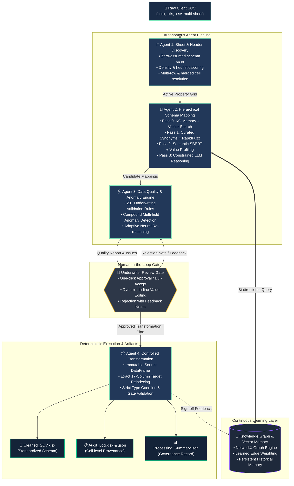

<div align="center">

# 🛡️ SOV-it
### **Agentic SOV Cleansing & Intelligence System**
*An autonomous, multi-agent AI system for underwriting data transformation, schema mapping, and property anomaly reasoning.*

[](https://share.streamlit.io)
[](https://www.python.org/)
[](LICENSE)
[](#high-level-system-architecture)
[](#team-astra)

---

**Developed by Team Astra**  
*In collaboration with **Adrosonic** and **Birla Institute of Technology, Mesra (BIT Mesra)***

</div>

---

## 📌 Executive Summary

Underwriting commercial property insurance requires processing unstructured, error-prone client **Statements of Values (SOV)** spreadsheets. In real-world underwriting workflows, disparate column headers, mixed alphanumeric notations, compound value errors, missing geographic markers, and inconsistent property construction codes introduce multi-million-dollar accumulation blindspots and manual cleansing delays.

**SOV-it** is an agentic, open-source AI platform that transforms arbitrary client SOVs into standardized, strictly-validated schemas. Designed around the core principle:
> ***"The language model proposes; deterministic logic and human underwriters verify and commit."***

The entire pipeline operates with **100% human-in-the-loop governance**, active graph memory across submissions, and a certified transformation gate guaranteeing zero schema drift.

---

## 🏛️ High-Level System Architecture



---

## 🤖 The Four Collaborating Agents

| Agent | Core Responsibilities | Technology & Technique |
| :--- | :--- | :--- |
| **Agent 1: Sheet & Header Discovery** | Analyzes multi-tab workbooks without pre-configured assumptions. Scores header candidates across rows 1–30 based on text ratio, density, insurance vocabulary, and value distribution below. Identifies totals rows and merges. | Heuristic scoring, cell-density distribution, OpenPyXL grid parsing. |
| **Agent 2: Hierarchical Schema Mapper** | Executes a multi-tier resolution strategy to map arbitrary source columns into the 17 standard insurance target fields: <br>• **Tier 0:** Knowledge Graph Memory & historical vector cache.<br>• **Tier 1:** Curated synonym dictionaries & RapidFuzz similarity ($\ge 0.75$).<br>• **Tier 2:** Semantic Sentence-BERT embeddings blended with value profiling.<br>• **Tier 3:** Zero-shot constrained LLM reasoning on remaining ambiguities. | NetworkX Graph, Sentence-BERT, RapidFuzz, Pluggable LLM. |
| **Agent 3: Data Quality & Neural Reasoning** | Validates 20+ underwriting rules (currency extraction, K/M/B expansion, negative values, construction code normalization, ZIP/State matching, Year Built plausibility). Automatically generates plain-English rationale explanations and executes **adaptive re-reasoning loops** upon underwriter rejection. | Rulebook engine, regex parsing, LLM-based explanatory reasoning. |
| **Agent 4: Controlled Transformation** | Purely deterministic code with zero LLM hallucinations. Enforces strict schema gates, applies only underwriter-approved transformations, preserves raw sources on an immutable copy, and compiles cell-level audit logs. | Pandas, OpenPyXL, cryptographic provenance hashing. |

---

## 🎨 Dithered Design System (TypeUI-Compliant)

SOV-it features a bespoke retro-modern **Dithered UI** engineered in Streamlit according to the [TypeUI Dithered Design Specification](https://www.typeui.sh/design-skills/dithered):

- **Atmospheric Dot-Pattern Textures**: Multi-layered SVG and CSS radial-gradient stippling simulating 1-bit and 2-bit halftone screens over deep maritime navy (`#1A2C47`).
- **Technical Typography Hierarchy**:
  - **Display / Headers**: *Space Grotesk* for technical headings and hero banners.
  - **Precision Tokens**: *IBM Plex Mono* for KPI values, severity badges, confidence ratings, and tabular metrics.
  - **Body / Documentation**: *Montserrat* for clear readability.
- **Dithered Micro-interactions**: Diagonal stippled progress tracking bars, tactile 1px high-contrast borders, and focused compound risk heatmaps.

---

## 🎯 Target Schema (17 Standard SOV Fields)

SOV-it maps and cleanses messy data into the industry standard 17-attribute insurance schema:

| Target Field | Data Type | Permissible Range / Formats | Validation / Cleansing Logic |
| :--- | :--- | :--- | :--- |
| `Location ID` | String / Alphanumeric | Unique property identifier | Trimmed, deduplicated, preserves leading zeros |
| `Street Address` | String | Postal street address | Cleaned punctuation, casing standardized |
| `City` | String | City name | Standardized casing, whitespace stripped |
| `State` | String | 2-Letter US Postal Code (`CA`, `NY`) | Resolves full state names to 2-letter codes |
| `Zip Code` | String | 5-Digit or 9-Digit (`12345`, `12345-6789`) | Padded leading zeros, standardizes hyphenation |
| `County` | String | County jurisdiction | Normalized naming conventions |
| `Country` | String | ISO country code or standard name | Resolves spelling drift (`USA`, `US`, `United States`) |
| `Building Value` | Float | $\ge 0$ | Strips currency (`$`, `€`), expands `K`/`M`/`B` |
| `Contents Value` | Float | $\ge 0$ | Numeric parsing, negative values flagged |
| `Business Interruption Value` | Float | $\ge 0$ | Standardized financial evaluation |
| `Total Insurable Value (TIV)` | Float | $\ge 0$ | Cross-checked against sum of components |
| `Square Footage` | Float | $\ge 0$ | Parses commas and area units (`sq ft`, `sf`) |
| `Number of Stories` | Integer | $\ge 1$ | Cast to whole integers; fractional stories flagged |
| `Year Built` | Integer | $1700 \le \text{Year} \le \text{Current Year}$ | Blocks future years; parses 2-digit years |
| `Construction Type` | Categorical | ISO Construction Classes (1–6, `MFR`, `NC`) | Normalized to standard structural codes |
| `Occupancy Type` | Categorical | Commercial occupancy codes (`Office`, `Retail`) | Curated insurance categorization |
| `Sprinkler Flag` | Categorical | `Y` / `N` / Valid sprinkler class (`13`, `13R`) | Standardized binary / code indicators |

---

## 🚀 Quickstart & Installation

### Option 1: Run Locally

```bash
# 1. Clone repository
git clone https://github.com/ranjanaashish/SOV-it.git
cd SOV-it

# 2. Set up virtual environment
python -m venv .venv
source .venv/bin/activate       # On Windows: .venv\Scripts\activate

# 3. Install dependencies
pip install -r requirements.txt

# 4. Launch the application
streamlit run app.py
```
*Access the local interface at `http://localhost:8501`.*

---

### Option 2: Run with Docker Compose

```bash
docker compose up -d --build
```

---

## ⚙️ Pluggable LLM Support

SOV-it supports zero-friction switching between local open-weights models and ultra-fast cloud inference engines directly via the sidebar **⚙️ LLM & Provider Settings**:

- ⚡ **Groq Cloud** (`llama-3.3-70b-versatile` — ~500 tokens/sec)
- 🧠 **Ollama Local** (`qwen2.5:7b-instruct` / `qwen2.5:3b-instruct` — 100% on-prem offline privacy)
- 🌐 **OpenAI / Azure OpenAI** (`gpt-4o-mini`, `gpt-4o`)
- 💎 **Google Gemini** (`gemini-1.5-flash` via OpenAI-compatible endpoint)
- 🔌 **Custom OpenAI Endpoints** (vLLM, LM Studio, LocalAI)
- 🛡️ **Rules-Only Deterministic Mode** (Instant execution with zero network dependency)

---

## 👥 Contributors & Team Astra

Developed with pride by **Team Astra** in collaboration with **Adrosonic** and **Birla Institute of Technology, Mesra (BIT Mesra)**:

| Contributor | Profile & Contributions |
| :--- | :--- |
| **Aashish Ranjan** | Core Architecture, Multi-Agent Orchestration & Streamlit UI ([@ranjanaashish](https://github.com/ranjanaashish)) |
| **Aastha Chhabra** | Machine Learning, Model Research & Underwriting Data Intelligence ([@aasthaaachhabra](https://github.com/aasthaaachhabra)) |
| **ADROSONIC Hackathon** | Hackathon Host, Insurance Domain Governance & Advisory ([@ADROSONICHackathon](https://github.com/ADROSONICHackathon)) |

---

<div align="center">
  <sub>Built for precision underwriting. MIT Licensed. © 2026 Team Astra.</sub>
</div>
